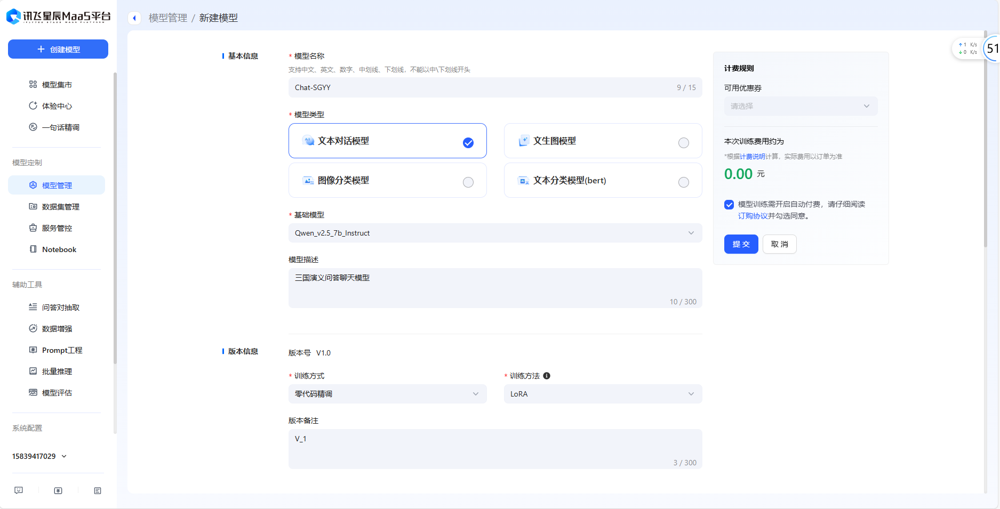
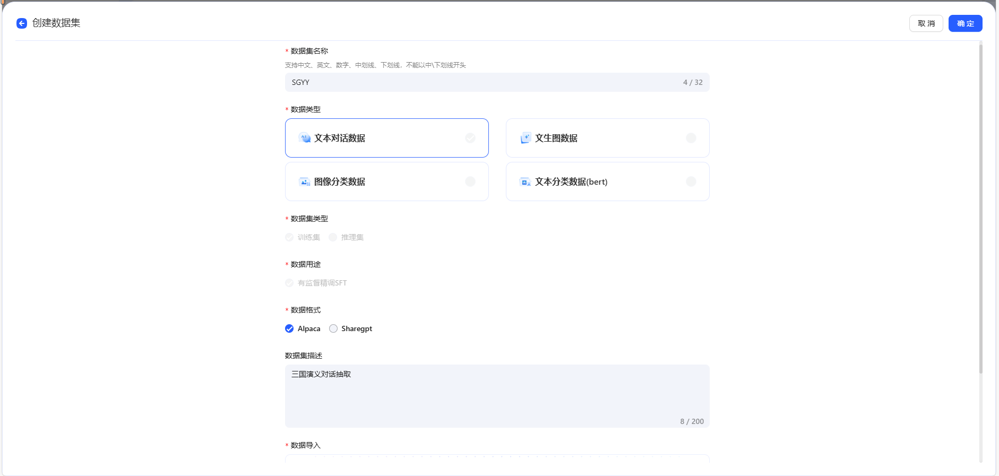
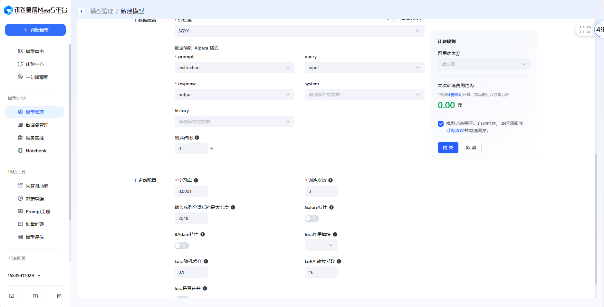

# Datawhale AI冬令营
## Chat-SGYY
**Chat-SGYY**是利用三国演义小说中所有章节的内容，基于**星火大模型**进行**LoRA微调**得到的三国演义问答语言模型。

>《三国演义》是中国古代四大名著之一，由明代小说家罗贯中所著。它基于三国时期（公元184年–280年）的历史背景，讲述了魏、蜀、吴三国之间的政治斗争、军事冲突、英雄人物和智勇谋略。《三国演义》通过复杂的权力斗争、军事谋略和个人英雄主义，探讨了诸如忠诚、智谋、义气和权谋等主题。它不仅是一部历史小说，也融合了大量的民间传说和文学创作，因此，书中的人物和故事成为了中国文化的重要组成部分，广泛影响了后代的文学创作和戏曲演绎。在中国和世界范围内，《三国演义》被改编为多个版本，包括戏剧、电影、电视剧、游戏等，成为极具影响力的文学经典。

OK，我们将使用[讯飞星辰Maa5平台](https://training.xfyun.cn/model/add)实现Chat-SGYY。

### Step 1: 数据集下载
我们首先需要准备《三国演义》所有章节的内容，下载链接为：[三国演义txt文件](https://www.isyd.net/books/4/4.txt)。 点击链接后另存为SGYY.txt。我们看下原始数据的格式：

```text
第一回 宴桃园豪杰三结义,斩黄巾英雄首立功
话说天下大势，分久必合，合久必分。周末七国分争，并入于秦。
及秦灭之后，楚、汉分争，又并入于汉。汉朝自高祖斩白蛇而起义，
一统天下;后来光武中兴，传至献帝，遂分为三国。推其致乱之由，
殆始于桓、灵二帝。桓帝禁锢善类，崇信宦官。及桓帝崩，
灵帝即位，大将军窦武、太傅陈蕃共相辅佐。时有宦官曹节等弄权，
窦武、陈蕃谋诛之，机事不密，反为所害，中涓自此愈横。
```

### Step 2: 数据预处理
#### Step 2.1: 问答抽取
我们需要从文本中抽取角色的对话数据，然后将其转换成我们需要的格式。对于这种数据，我们使用[讯飞星辰MaaS平台的问答对抽取功能](https://training.xfyun.cn/questionAnswerExtract)，直接进行数据构建。

创建任务后并运行后，大概需要**20min**完成问答抽取。

完成后，我们可以查看部分数据，并直接下载数据集，下载的数据集格式为**jsonl**。


#### Step 2.2: 转换json格式
等待对话抽取完成后，我们将其整理成**json**格式的数据。我们在代码中提供了使用**pandas**库和**json**库分别实现。这里我们使用**json**库实现。

1. 读取文件
```
import json

# 使用json读取对话抽取的.jsonl文件
data_save_dir = '你的json文件保存路径'
with open(data_read_dir, 'r', encoding='utf-8') as f:
    dialogues = []
    for line in f:
        contennt = json.loads(line)
        dialogues.append(contennt)

# 打印问答数
print(len(dialogues))

```
2. 定义build_json_data函数。

```
def build_json_data(dialogues, json_file):
    result = []
    for act in dialogues:
        sample = {
            "instruction": act["input"],
            "input": "",
            "output": act["target"]
        }
        result.append(sample)

    with open(json_file, 'w', encoding='utf-8') as f:
        json.dump(result, f, ensure_ascii=False, indent=4)
``` 
3. 保存文件
```
data_save_dir = '你的json文件保存路径'
build_json_data(dialogues, data_save_dir)
```

最后的数据集效果大致如下：
```text
[
    {
        "instruction": " 张角在黄巾起义中自称为什么将军？",
        "input": "",
        "output": " 天公将军。"
    },
    {
        "instruction": " 关羽的青龙偃月刀重多少斤？",
        "input": "",
        "output": " 八十二斤。"
    },
]
```
### Step 3: 配置微调参数
训练集构建完成后，就可以通过[讯飞星辰Maa5平台](https://training.xfyun.cn/model/add)中的步骤，上传数据，配置模型训练参数，对星火大模型进行微调。

#### Step 3.1: 构建模型

基础模型大家可以根据自己的情况选择，我选择的基础模型是Qwen_v2.5_7b_Instruct。
> ~~ps: 使用Spark Lite排队9h，最后运行失败，崩溃， QwQ。如果不想花太长时间，建议使用比较小的模型~~
#### Step 3.2: 上传数据

上传我们预处理好的数据集。

#### Step 3.1: 配置模型参数

由于本人水平有限，我设置的均为默认参数。

### Step 4: 体验

我们可以问模型关于三国演义内容的问题。
>经测试，由于数据集较小和模型大小的原因（819条问答数据），可能会出现错误的回答。大家可以使用更多的数据和更大的模型。

最后，感谢[Datawhale](https://www.datawhale.club/home)的开源内容，以上内容参考[Datawhale AI冬令营（第一期)](https://www.datawhale.cn/activity/110?subactivity=21)